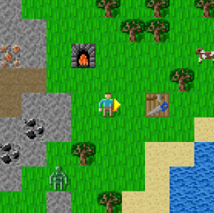
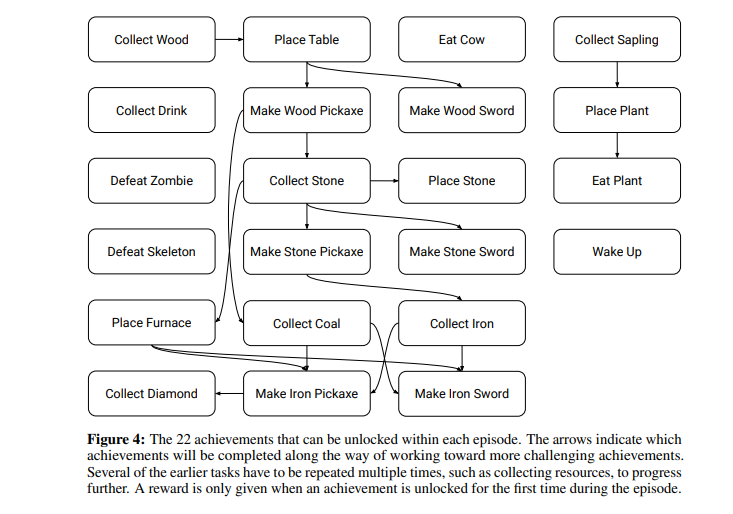
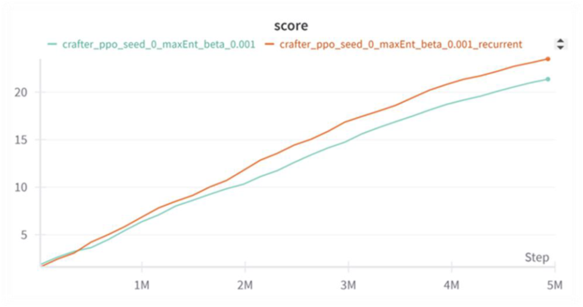

# Exploration-Driven Reinforcement Learning on Crafter

Adapting the [ExpGen (Explore to Generalize)](https://arxiv.org/abs/2306.03072) algorithm for zero-shot reinforcement learning on the [Crafter](https://github.com/danijar/crafter) benchmark.

**Authors:** David Levit, Liron Kenigshtain

**Supervisor:** Ev Zisselman

**Lab:** CRML, Technion - Israel Institute of Technology

**Semester:** Spring 2024


---

## Abstract

This project investigates the generalization abilities of reinforcement learning algorithms on the Crafter benchmark -- an open-world survival game with visual inputs that evaluates a wide range of general abilities within a single environment. We design an ExpGen-inspired algorithm that integrates two key modifications into baseline PPO: (1) a GRU-based recurrence mechanism for handling partial observability, and (2) a MaxEnt intrinsic reward function that encourages exploration through entropy maximization in the state space. Our experiments show that combining memory and intrinsic exploration leads to the highest scores among all tested configurations.

---

## Main Contributions

- Adapted an ExpGen-inspired exploration framework to the Crafter environment.
- Extended PPO with GRU-based recurrence to improve performance under partial observability.
- Integrated a MaxEnt intrinsic reward mechanism for exploration-driven generalization.
- Compared PPO baselines, recurrent PPO variants, and exploration-enhanced agents on Crafter.
- Evaluated agent performance using Crafter achievement-based generalization metrics.

---

## Environment Overview

### Crafter Gameplay Environment

<p align="center">
  
</p>

[Crafter](https://github.com/danijar/crafter) is a procedurally generated 2D survival environment inspired by Minecraft, designed to evaluate long-term planning, exploration, and generalization in reinforcement learning agents.

### Crafter Achievement Tree

<p align="center">
  
</p>

The environment contains 22 hierarchical achievements that require increasingly complex behaviors and multi-step planning.
Score is based on the agent ability to unlock achievements : `S = exp(mean(ln(1 + s_i))) - 1`, where `s_i` is the success rate for achievement `i`. 
This scoring mechanism rewards broad achievement coverage rather than specializing in only a few tasks, meaning that even small improvements on difficult achievements can significantly increase the overall score. 

---

## Background

### ExpGen

[ExpGen](https://arxiv.org/abs/2306.03072) (NeurIPS 2023) is a zero-shot generalization approach for RL that:
1. Trains an ensemble of reward-maximizing agents
2. Trains a separate maximum entropy (MaxEnt) policy
3. At test time: uses the ensemble when agents agree on an action, and falls back to the MaxEnt policy when they disagree

### Achievement Distillation (SOTA)

The current state-of-the-art on Crafter is [Achievement Distillation](https://arxiv.org/abs/2307.03486), which extends PPO with contrastive learning to predict next achievements. It achieves a score of 21.79 using only 1M environment steps.

---

## Our Algorithm

We modify baseline PPO with two additions:

1. **GRU Recurrence** -- A GRU-RNN layer that gives the agent memory of past states, critical for handling Crafter's partial observability and delayed rewards.

2. **MaxEnt Intrinsic Reward** -- An entropy-based intrinsic reward that encourages the agent to visit novel states. The total reward combines:
   - Extrinsic reward from the Crafter environment
   - Intrinsic reward from MaxEnt evaluation, scaled by parameter `beta`

```
r_total = r_extrinsic + beta * r_intrinsic
```

---

## Results

Our experiments compared several agent configurations over 5M environment steps on the Crafter benchmark.

| Configuration | Best Crafter Score |
|---|---:|
| PPO baseline | ~19 |
| PPO + intrinsic reward (`beta = 0.001`) | ~18 |
| PPO + recurrence | ~20 |
| PPO + recurrence + intrinsic reward (`beta = 0.001`) | ~22 |
| PPO + recurrence + intrinsic reward (`beta = 0.005`) | ~22 |

**Takeaway:** The combination of recurrence and a well-tuned intrinsic reward (beta) achieves the highest Crafter score by enabling the agent to both remember past experience and explore novel states effectively.

### Training Curves

<p align="center">
  
</p>

The recurrent PPO + MaxEnt configurations consistently achieved the highest Crafter scores during training.

### Agent Gameplay

#### PPO Baseline

https://github.com/user-attachments/assets/0fbb5e60-208c-4090-a705-0968a070db1b

#### PPO + MaxEnt + Recurrence


https://github.com/user-attachments/assets/d56c0086-ac2f-4f02-8fef-f85b2564404b


The exploration-enhanced recurrent agent demonstrates improved long-term exploration and broader achievement discovery compared to the PPO baseline.

### Key Findings

- **Recurrence alone** significantly improves performance by helping the agent handle partial observability and long-term dependencies.
- **Intrinsic reward alone** without recurrence did not yield a clear advantage; careful tuning of `beta` is critical.
- **Recurrence + intrinsic reward combined** achieved the highest scores across all tested configurations.
- **Moderate intrinsic reward scaling** (`beta ≈ 0.001-0.005`) produced the best balance between exploration and task completion.

---

## Project Structure

```
expgen-crafter/
├── train_ppo_crafter.py          # Train PPO agent on Crafter
├── train_maxEnt_crafter.py       # Train MaxEnt agent on Crafter
├── train_ppo.py                  # Train PPO agent on ProcGen
├── train_maxEnt.py               # Train MaxEnt agent on ProcGen
├── train_LEEP.py                 # Train LEEP variant on ProcGen
├── expgen_ensemble.py            # Ensemble-based evaluation
├── evaluation.py                 # Evaluation utilities
├── plot.py                       # Result visualization
├── environment.yml               # Conda environment specification
├── PPO_maxEnt_LEEP/              # Core RL library
│   ├── algo/
│   │   ├── ppo.py                # PPO algorithm implementation
│   │   └── ppo_LEEP.py           # PPO with LEEP variant
│   ├── model.py                  # Neural network architectures (ImpalaModel, Policy)
│   ├── storage.py                # Rollout buffer for trajectory storage
│   ├── arguments.py              # CLI argument definitions
│   ├── envs.py                   # Environment creation and wrappers
│   ├── procgen_wrappers.py       # Observation preprocessing wrappers
│   ├── logger.py                 # Training and evaluation logging
│   ├── distributions.py          # Action space distributions
│   ├── hyperparams.py            # Per-environment hyperparameters
│   ├── constant.py               # Crafter task definitions (22 achievements)
│   ├── utils.py                  # Helper functions
│   └── video_recorder_crafter_ad.py  # Video recording utility
├── figures/                      # Result images
└── wandb/                        # Weights & Biases experiment logs
```

---

## Installation

**Requirements:** Ubuntu 18.04+, Python 3.7+, CUDA-capable GPU recommended

```bash
git clone <repo-url>
cd expgen_crafter/expgen-crafter

conda env create -f environment.yml
conda activate expgen_env_test

pip install procgen
pip install crafter
```

If you encounter `ImportError: libffi.so.7`, try: `pip install cffi==1.13.0`

---

## Usage

All training commands should be run from the `expgen-crafter/` directory.

### Train PPO on Crafter (baseline)

```bash
python train_ppo_crafter.py --env-name crafter --seed 0 --num-env-steps 5000000
```

### Train PPO with recurrence

```bash
python train_ppo_crafter.py --env-name crafter --seed 0 --recurrent-policy --num-env-steps 5000000
```

### Train MaxEnt agent on Crafter (with intrinsic reward)

```bash
python train_maxEnt_crafter.py --env-name crafter --seed 0 --num-env-steps 5000000
```

### Train with recurrence + intrinsic reward (best configuration)

```bash
python train_maxEnt_crafter.py --env-name crafter --seed 0 --recurrent-policy --num-env-steps 5000000
```

### Key Arguments

| Argument | Default | Description |
|----------|---------|-------------|
| `--seed` | 0 | Random seed |
| `--num-env-steps` | 25M | Total environment steps |
| `--recurrent-policy` | False | Enable GRU recurrence |
| `--lr` | 5e-4 | Learning rate |
| `--gamma` | 0.999 | Discount factor |
| `--num-processes` | 32 | Parallel environments |
| `--num-steps` | 512 | Steps per rollout |
| `--ppo-epoch` | 3 | PPO update epochs |
| `--recurrent-hidden-size` | 256 | GRU hidden layer size |
| `--num_buffer` | 500 | Buffer size for k-NN intrinsic reward |
| `--neighbor_size` | 3 | k in k-NN for intrinsic reward |
| `--gpu_device` | 0 | CUDA device ID |

### ProcGen Experiments

Train on ProcGen environments (e.g., Maze):

```bash
# PPO ensemble (use seeds 0-9)
python train_ppo.py --env-name maze --seed 0 --use_backgrounds

# MaxEnt agent
python train_maxEnt.py --env-name maze --seed 0 --use_backgrounds

# Evaluate ensemble
python expgen_ensemble.py --env-name maze --use_backgrounds
```

---

## References

1. Zisselman, E., et al. "Explore to Generalize in Zero-Shot RL." NeurIPS 2023. [arXiv:2306.03072](https://arxiv.org/abs/2306.03072)
2. Moon, S., et al. "Discovering Hierarchical Achievements in Reinforcement Learning via Contrastive Learning." [arXiv:2307.03486](https://arxiv.org/abs/2307.03486)
3. Hafner, D. "Benchmarking the Spectrum of Agent Capabilities." ICLR 2022. (Crafter benchmark)

---

## Acknowledgements

This code is based on the open-source [ExpGen](https://github.com/EvZissel/expgen) implementation and [PyTorch PPO](https://github.com/ikostrikov/pytorch-a2c-ppo-acktr-gail).

---

## License

MIT License. See [LICENSE](expgen-crafter/LICENSE).
